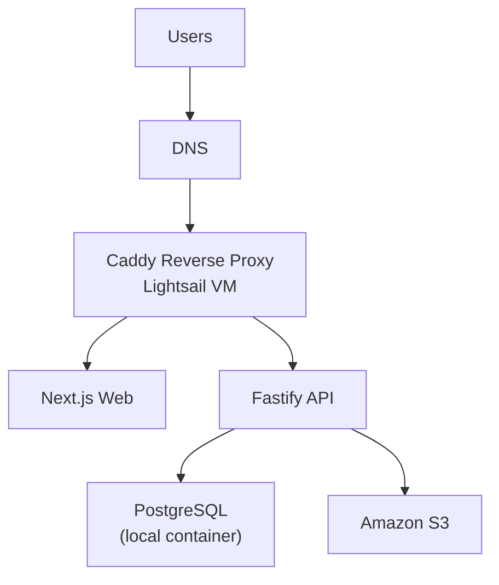

# AWS Lightsail Runbook

Bu doküman, uygulamanın AWS üzerinde en ekonomik canlı yayını için önerilen mimariyi ve Lightsail kurulum adımlarını içerir.

## 1. Önerilen Mimari

Ekonomik başlangıç için en uygun model:

1. Tek bir `AWS Lightsail` Ubuntu instance
2. Docker Compose ile `web`, `api`, `postgres`, `caddy`
3. Dosya storage için `Amazon S3`
4. İki subdomain:
   - `app.example.com` -> web
   - `api.example.com` -> api



## 2. Başlangıç Boyutu

Ekonomik seçenek:

1. `2 GB RAM / $12`

Daha güvenli başlangıç:

1. `4 GB RAM / $24`

Bu proje için üretim başlangıcında `4 GB` daha rahat olur. `2 GB` sadece düşük trafik ve sıkı kaynak kullanımı için uygundur.

## 3. Dosyalar

Bu repoda hazırlanan üretim dosyaları:

1. [/Users/fatihsengor/Codex/CRM/docker-compose.prod.yml](/Users/fatihsengor/Codex/CRM/docker-compose.prod.yml)
2. [/Users/fatihsengor/Codex/CRM/apps/api/Dockerfile](/Users/fatihsengor/Codex/CRM/apps/api/Dockerfile)
3. [/Users/fatihsengor/Codex/CRM/apps/web/Dockerfile](/Users/fatihsengor/Codex/CRM/apps/web/Dockerfile)
4. [/Users/fatihsengor/Codex/CRM/deploy/lightsail/Caddyfile](/Users/fatihsengor/Codex/CRM/deploy/lightsail/Caddyfile)
5. [/Users/fatihsengor/Codex/CRM/deploy/lightsail/.env.prod.example](/Users/fatihsengor/Codex/CRM/deploy/lightsail/.env.prod.example)

## 4. Lightsail Kurulum Adımları

1. Lightsail üzerinde Ubuntu instance oluştur.
2. Instance boyutu olarak `4 GB` seç.
3. Static IP ekle ve instance'a bağla.
4. DNS tarafında şu kayıtları oluştur:
   - `app.example.com` -> Lightsail static IP
   - `api.example.com` -> Lightsail static IP
5. Sunucuya SSH ile bağlan.
6. Docker ve Docker Compose plugin kur.
7. Repo'yu sunucuya çek.
8. Prod env dosyasını hazırla:
   - `cp deploy/lightsail/.env.prod.example deploy/lightsail/.env.prod`
9. `deploy/lightsail/.env.prod` içindeki alanları gerçek değerlerle doldur.
10. Uygulamayı ayağa kaldır:
   - `docker compose --env-file deploy/lightsail/.env.prod -f docker-compose.prod.yml up -d --build`

## 5. Sunucu Hazırlık Komutları

Ubuntu üzerinde:

```bash
sudo apt update && sudo apt upgrade -y
sudo apt install -y ca-certificates curl git
curl -fsSL https://get.docker.com | sudo sh
sudo usermod -aG docker $USER
newgrp docker
docker --version
docker compose version
```

## 6. Repo ve Deploy

```bash
git clone <YOUR_REPO_URL> crm
cd crm
cp deploy/lightsail/.env.prod.example deploy/lightsail/.env.prod
nano deploy/lightsail/.env.prod
docker compose --env-file deploy/lightsail/.env.prod -f docker-compose.prod.yml up -d --build
```

Log kontrolü:

```bash
docker compose -f docker-compose.prod.yml ps
docker compose -f docker-compose.prod.yml logs -f api
docker compose -f docker-compose.prod.yml logs -f web
docker compose -f docker-compose.prod.yml logs -f caddy
```

## 7. S3 Hazırlığı

1. AWS içinde bir S3 bucket oluştur:
   - örnek: `rfq-attachments-prod`
2. Bucket region ile `.env.prod` içindeki `STORAGE_REGION` aynı olmalı.
3. API için yalnızca bu bucket'a erişebilen bir IAM user oluştur.
4. IAM access key bilgilerini şu alanlara gir:
   - `STORAGE_ACCESS_KEY`
   - `STORAGE_SECRET_KEY`

Örnek S3 ayarları:

1. `STORAGE_ENDPOINT=s3.eu-central-1.amazonaws.com`
2. `STORAGE_PORT=443`
3. `STORAGE_USE_SSL=true`

## 8. Deploy Sonrası Kontrol

1. `https://app.example.com/login` açılıyor mu?
2. `https://api.example.com/health` `200 OK` dönüyor mu?
3. Admin kullanıcı login olabiliyor mu?
4. Yeni RFQ oluşturulabiliyor mu?
5. PDF upload çalışıyor mu?
6. Dosya indirme çalışıyor mu?

## 9. Güncelleme Akışı

Yeni sürüm deploy etmek için:

```bash
git pull
docker compose --env-file deploy/lightsail/.env.prod -f docker-compose.prod.yml up -d --build
```

## 10. Backup

Minimum güvenlik önlemleri:

1. Lightsail instance snapshot'ını günlük aç.
2. S3 bucket versioning'i etkinleştir.
3. Haftalık `pg_dump` yedeği al.

Örnek veritabanı yedeği:

```bash
docker compose -f docker-compose.prod.yml exec postgres \
  pg_dump -U "$POSTGRES_USER" "$POSTGRES_DB" > backup-$(date +%F).sql
```

## 11. Notlar

1. Bu kurulum en ekonomik AWS başlangıç modelidir, en managed model değildir.
2. Trafik büyüdüğünde ilk ayrıştırılacak servis genelde `postgres` olur.
3. Sonraki adımda istenirse `RDS` ve `ECS` mimarisine geçiş yapılabilir.
